<table align="right">
	<thead>
		<tr>
			<th style="text-align:center">English</th>
			<th style="text-align:center"><a href="index_ja">Japanese</a></th>
		</tr>
	</thead>
</table>
  

    

"I'm going to become a famous fighter!" That is your dream.

The fastest way to achieve it is to enter the "Fist Rush" tournament and reach the number one spot in the rankings. The top-ranked fighter is known as an "Elite"—a figure respected by all.

In this tournament, you fight with nothing but your fists. Defend against your opponent's punches while landing your own to defeat them. Win three matches in a row to rank up; lose three in a row to rank down.

So, do you have what it takes to conquer "Fist Rush" and become an Elite?

## Install
You can install it from Google Play.

    

  
  <a href="https://play.google.com/store/apps/details?id=com.studiosuzu.app.fistrush">[ Morse Attack ] Google Play</a>

## How to play

### （０）Screen display

    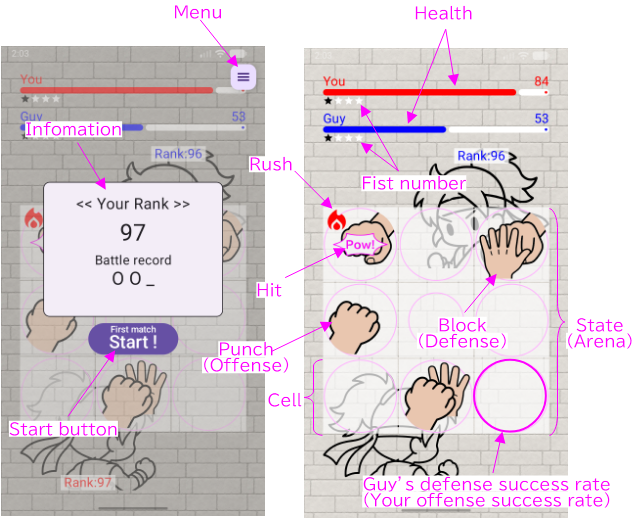

### （１）Press the start button

Press the Start button. Opponent information will be displayed, and then the match will begin.

    

### （２）Offense

Clicking an blank cell unleashes a punch.

    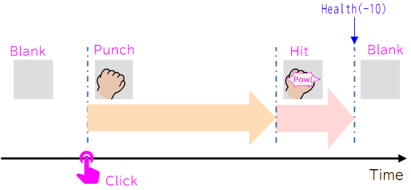

After some time has passed, the move transitions into a hit, and the opponent is struck by the punch.

### （３）Defense

Click on the opponent's punch to block it.

    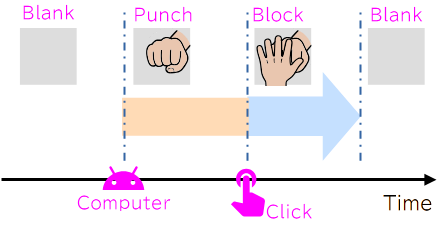

If you defend, you will not take damage (your Health will not decrease).

### （４）Win / Loss

A competitor loses if their Health drops to zero.

    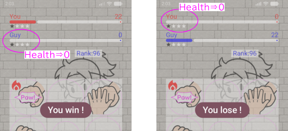

Please note that the Health of both fighters(You and Guy) gradually decreases over time.

If both fighters' Health reaches zero at the same time, the result is a draw.

## Other rules

- Defense success rate

  The circle displayed on the stage represents the opponent's defense success rate. By concentrating attacks in a clockwise direction, you can temporarily lower the defense success rate at the center. 

  As the opponent's defense success rate drops, the attack success rate of the opposing combatant rises.

  

    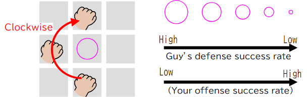
  

- Fists count

  The "fist count" refers to the total number of punches and blocks performed on stage. You cannot execute more punches or blocks than the maximum allowed number of actions; this maximum is determined by the competitor's rank.

    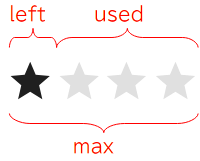

- Selection of Opponents

  Opponents are randomly selected from a range of ±2 ranks. Opponents possess specific characteristics and are categorized into offensive, defensive, and balanced types.

  | ランク | 表示名 | 
特徴
 | コメント |
  | ---- | ---- | ---- | ---- |
  |  | ??? | Limitless | ←あなた |
  | 低い | Beg | Beginner |
  |  | DefeC | DefensiveC |
  |  | OffeC | OffensiveC |
  |  | Mid | Middle |
  |  | DefeC | DefensiveC |
  |  | OffeC | OffensiveC |
  |  | Adv | Advanced |
  |  | DefeC | DefensiveC |
  |  | OffeC | OffensiveC |
  |  | Exp | Expert |
  | 高い | Elite | Elite |

  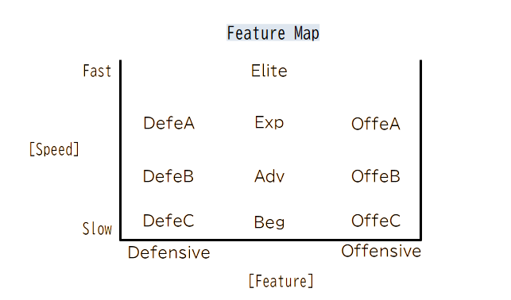

- Selection of the stage

  There are four types of stages: 2x2, 3x3, 4x4, and 5x5. The stage type is determined by the fighters' ranks. 

  If the fighters have different ranks, the stage corresponding to the higher rank is used.

  

- Rematch

  If the match is suspended, a rematch between the same opponents will take place.

## Strategy Guide (Aim for the number one spot in the rankings!)

- Concentrated attack
  
  This is a punching attack executed after sufficiently lowering the opponent's central defense success rate with a clockwise attack. It has a high probability of landing the punch.

    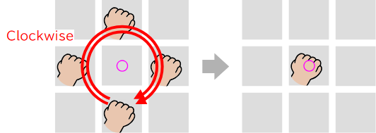

- Multi punch
  
  Click two or more cells simultaneously. You can unleash two or more punches at once, provided the number of punches does not exceed your remaining moves. 
  
  Whether a multi-punch attack can be blocked depends on the opponent's agility.

    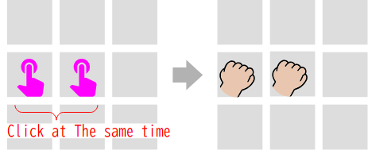

- Multi-hit attack

  Clicking while your punch is in the "Hit" state allows you to unleash consecutive punches. Punches marked with the "Rush" icon (flame symbol) are characterized by a faster transition to the hit state compared to standard punches.

  The diagram shows an example of a "two-hit combo." You can continue the sequence further.

    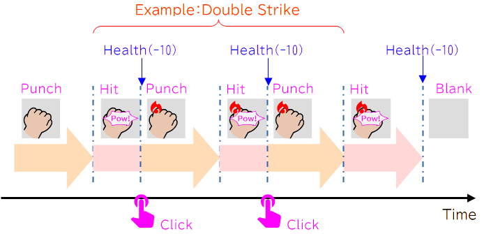

 - Counter attack

  Clicking when the opponent's punch is in the "Hit" state allows you to unleash a counter-punch. Punches marked with the "Rush" icon (flame symbol) are characterized by a faster transition to the "Hit" state compared to standard punches.

  You can also follow up a counter-punch with a rapid-fire combo.

    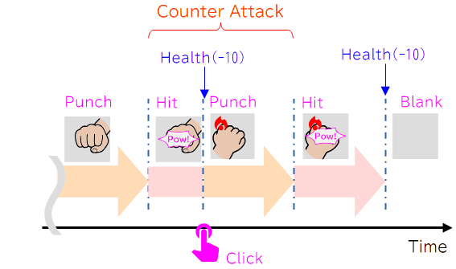

## Options

- Sound

  You can adjust the sound effect volume under <mark style="background-color: lightgray">Menu>Sound</mark>. The value is specified as a percentage of the device's volume. The default is 50%.

    

## Privacy Policy

  <a href="https://fistrush.github.io/pp/privacy_policy_en.html">Privacy Policy</a>

## Inquiries

StudioSuzu.Support@gmail.com

---
※QR Code is a registered trademark of DENSO WAVE INCORPORATED in Japan and in other countries.