<table align="right">
	<thead>
		<tr>
			<th style="text-align:center"><a href="index">英語</a></th>
			<th style="text-align:center">日本語</th>
		</tr>
	</thead>
</table>
  

    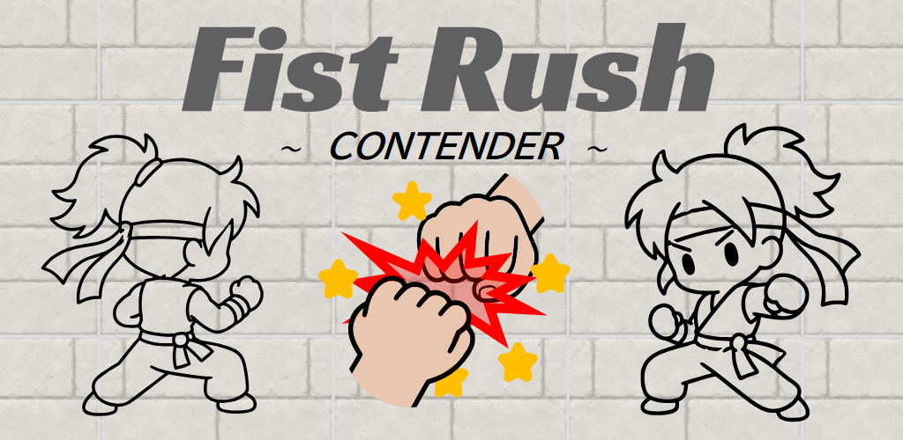

「俺は有名な格闘家になるんだ！」それが君の夢だ。

その夢を叶える一番の近道は、「Fist Rush」トーナメントに参加し、ランキング1位を目指すことだ。トップに君臨する格闘家は「Elite」と呼ばれ、誰もが尊敬する存在となる。

​​このトーナメントでは、拳だけを武器に戦う。相手のパンチを防御しつつ、自分のパンチを繰り出して勝利を掴むのだ。3連勝すればランクアップ、3連敗すればランクダウンとなる。

さあ、君には「Fist Rush」を制覇し、「Elite」になるだけの力があるだろうか？

## インストール
Google Playからインストールできます。

    

  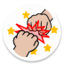
  <a href="https://play.google.com/store/apps/details?id=com.studiosuzu.app.fistrush">[ Fist Rush ] Google Play</a>

## 遊び方

### （０）画面表示

    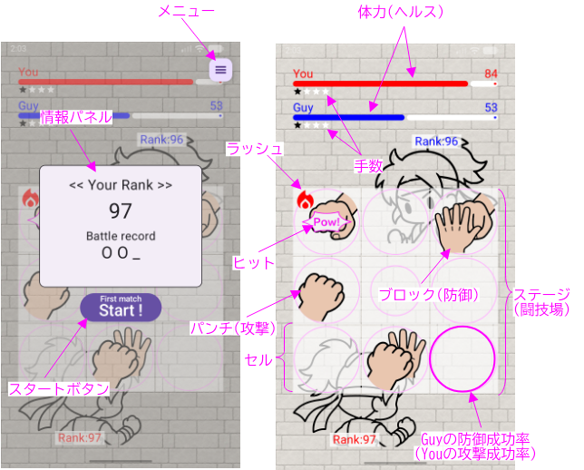

### （１）スタートボタンを押す

スタートボタンを押します。対戦者情報が表示され、その後、試合が開始されます。

    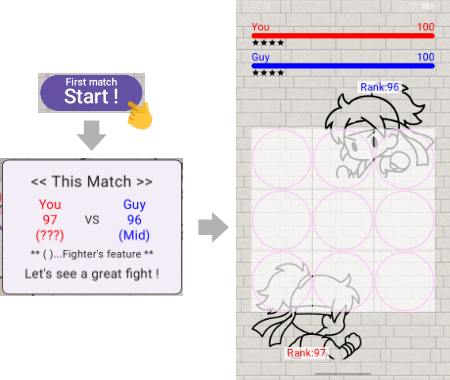

### （２）攻撃

空欄のセルをクリックすると、パンチが放たれます。

    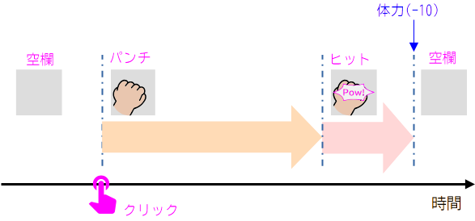

時間が経過した後、ヒットに変わり、この時点で対戦者にパンチが当たります。

### （３）防御

対戦者のパンチをクリックすると、パンチを受け止めます。

    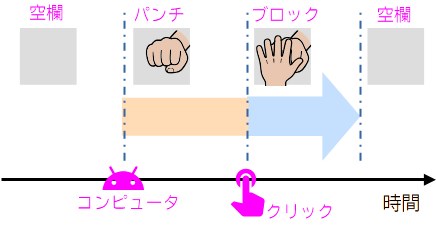

防御を行えば、ダメージを受ける（体力が減る）ことはありません。

### （４）勝ち・負け

体力が０になった対戦者の「負け」です。

    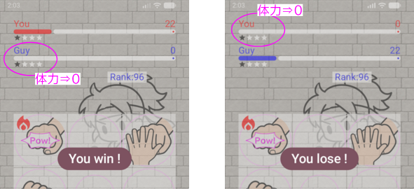

両者（YouとGuy）の体力は、時間経過と共に徐々に減っていく点に注意して下さい。

体力が同時に０になった場合は、「引き分け」です。

## その他ルール

- 防御成功率
  
  ステージ上に表示される円は対戦者の防御成功率を表しています。時計回りに集中攻撃を行うことで、中心の防御成功率を一時的に下げることが可能です。

  対戦者の防御成功率が低くなると、相反する対戦者の攻撃成功率は高くなります。

    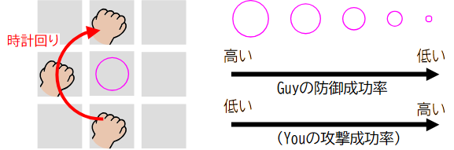

- 手数
  
  手数とは、ステージ上に存在するパンチ数とブロック数の合計です。手数の最大数を超えてパンチ及びブロックは放てません。手数の最大数は対戦者のランクで決まります。

    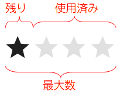

- 対戦者の選定

  対戦者は同ランク±2の範囲からランダムに選定されます。対戦者は特徴を持ち、攻撃型、防御型、中間型に分けられます。

  | ランク | 表示名 | 
特徴
 | コメント |
  | ---- | ---- | ---- | ---- |
  |  | ??? | Limitless | ←あなた |
  | 低い | Beg | Beginner |
  |  | DefeC | DefensiveC |
  |  | OffeC | OffensiveC |
  |  | Mid | Middle |
  |  | DefeC | DefensiveC |
  |  | OffeC | OffensiveC |
  |  | Adv | Advanced |
  |  | DefeC | DefensiveC |
  |  | OffeC | OffensiveC |
  |  | Exp | Expert |
  | 高い | Elite | Elite |

  

    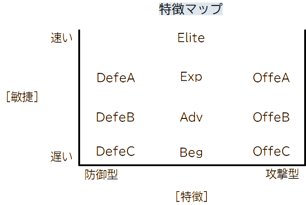
  

- ステージの選定

  ステージは2x2、3x3、4x4、5x5の４タイプがあります。ステージのタイプは対戦者のランクで決まります。
  
  また、対戦者のランクが異なるときは、ランクの高い方のステージが採用されます。
  
  

    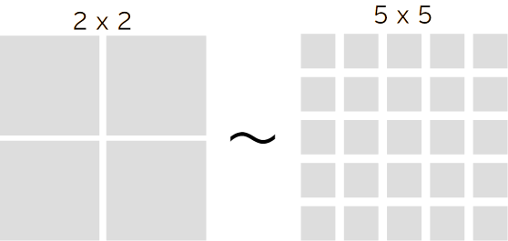
  

- 再試合

  試合が中断された場合は、同じ対戦者の再試合になります。

## 攻略法（ランキング１位をめざせ！）

- 集中攻撃
  
  時計回りの攻撃で中心の防御成功率を十分下げた後に、パンチを放つ攻撃です。高い確率でパンチを当てることが出来ます。

    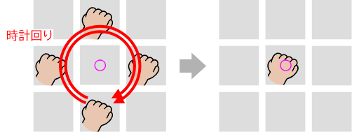

- マルチパンチ
  
  二つ以上のセルを同時にクリックします。二つ以上のパンチを同時に放つことが出来ます。ただし、パンチの数は手数の残数の範囲内です。

  マルチパンチを防御できるかどうかは、対戦者のスピードに依存します。

    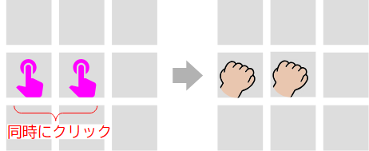

- 連撃

  自身のパンチがヒットしているタイミングでクリックすると、連続してパンチを放てます。ラッシュ(炎マーク)が付いたパンチは、通常のパンチよりも短い時間でヒットへ遷移する点が特徴です。

  図は「２連撃」の例です。さらに続けることも可能です。

    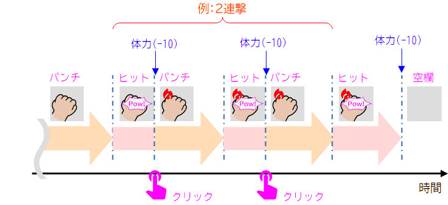

- カウンター

  相手のパンチがヒットしているタイミングでクリックすると、カウンターパンチを放てます。ラッシュ(炎マーク)が付いたパンチは、通常のパンチよりも短い時間でヒットへ遷移する点が特徴です。

  カウンターの後、さらに連撃へ切り替えることも可能です。

    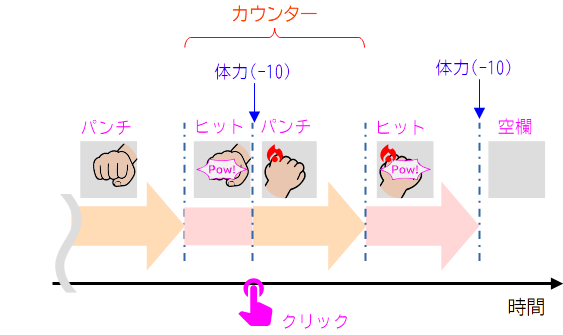

## オプション機能

- サウンド

  <mark style="background-color: lightgray">Menu>Sound</mark>から効果音の音量の変更が可能です。値はデバイスの音量のパーセンテージで指定します。デフォルトは50%です。

    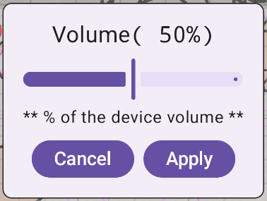

## プライバシーポリシー

  <a href="https://fistrush.github.io/pp/privacy_policy_ja.html">プライバシーポリシー</a>

## 問い合わせ先

StudioSuzu.Support@gmail.com

---
※QRコードは「株式会社デンソーウェーブ」の登録商標です。